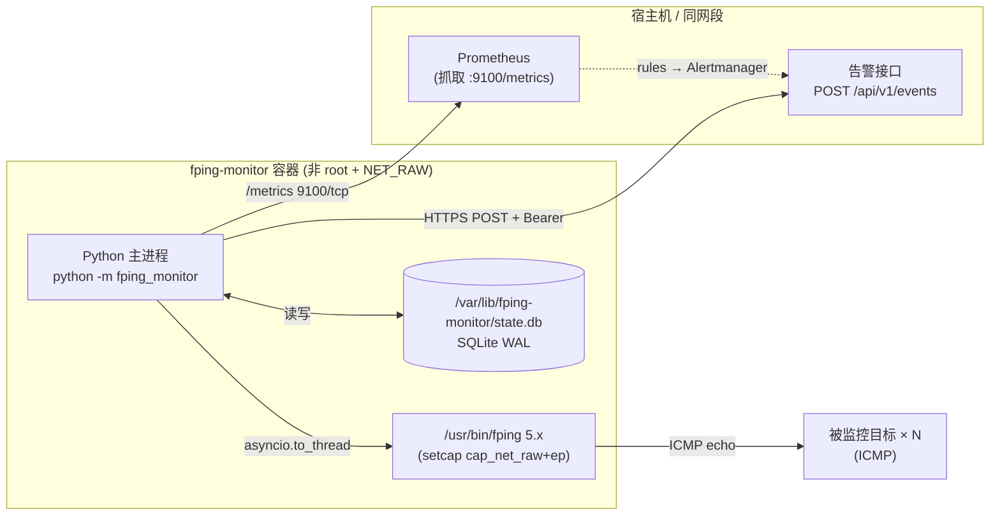
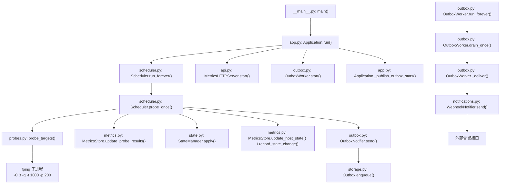
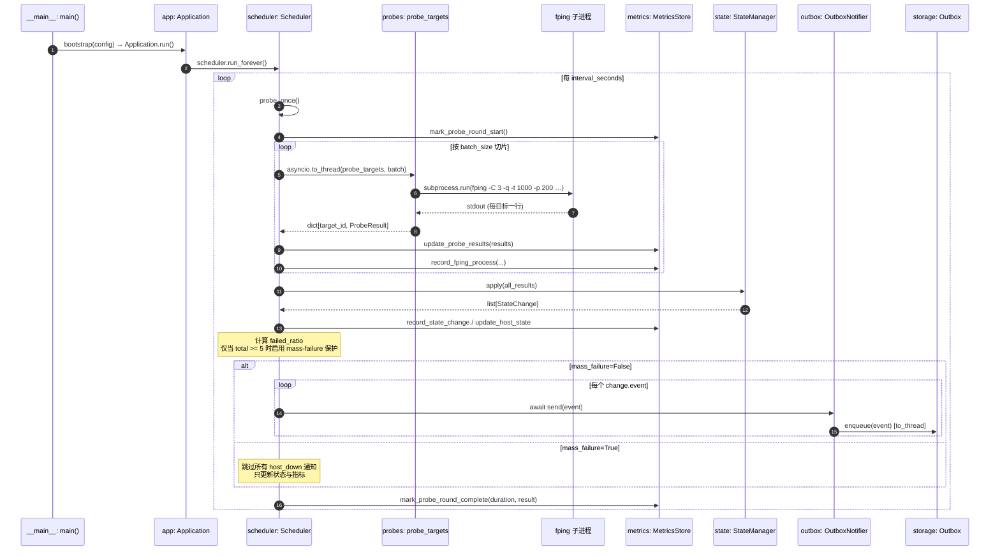
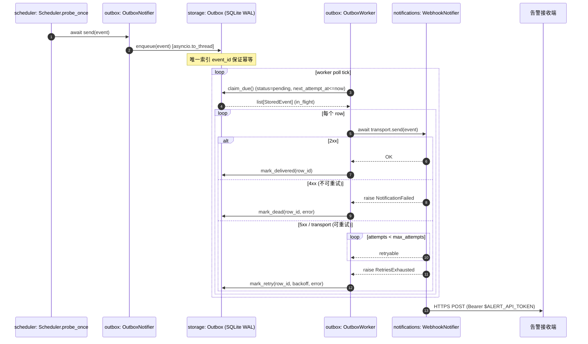
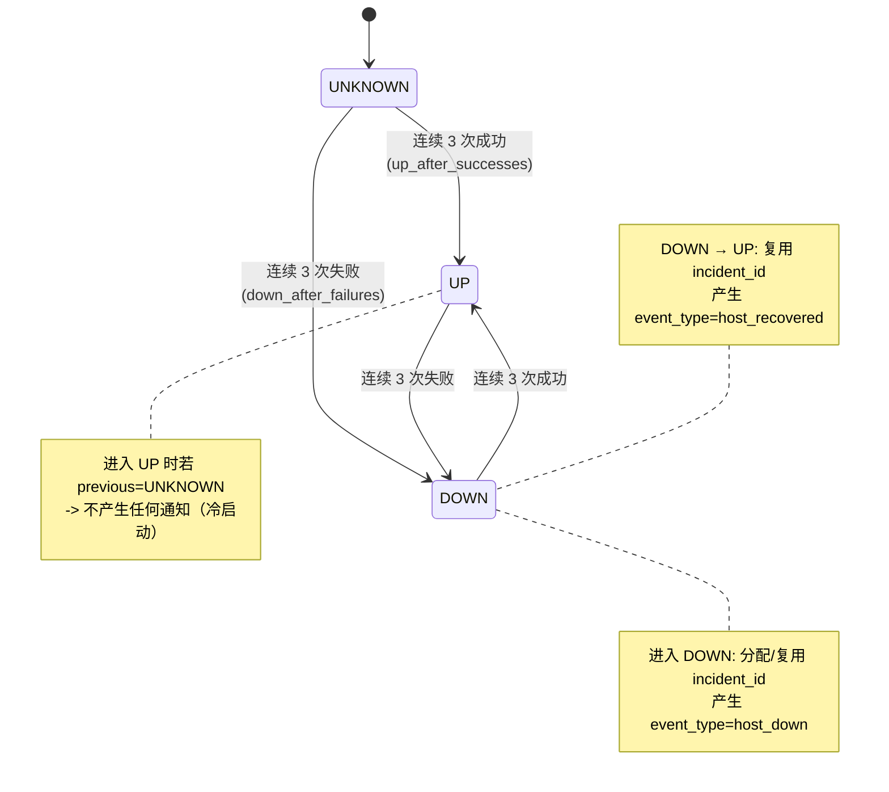

# fping-monitor 架构图

本文档用图把 `arch.md` 的文字设计与 `src/fping_monitor/` 下的真实代码对应起来。每张 Mermaid 图的节点都使用了相对路径（`src/fping_monitor/...`）作为可点击链接，渲染后会直接跳到代码位置。

阅读建议：先看 [1. 部署/进程视图](#1-部署进程视图) 与 [2. 容器内模块视图](#2-容器内模块视图) 把握整体；再按需深入 [3. 探测主循环](#3-探测主循环调用链) / [4. 通知投递](#4-通知投递调用链) / [5. HTTP 端点](#5-http-与健康检查视图) / [6. 状态机](#6-状态机迁移图)；最后用 [7. 模块速查表](#7-模块速查表) 找到具体实现。

## 1. 部署/进程视图



要点：

- fping 需要 `CAP_NET_RAW` 才能发 ICMP；通过 `setcap` 让非 root 用户也能用，无需 root 进程。
- SQLite 状态文件必须挂载持久卷，否则容器重启会丢失未发送告警。
- Prometheus 走 Pull；如果业务侧已经部署 Alertmanager，可让它负责告警去重、分组与抑制。

## 2. 容器内模块视图



模块速记（按职责）：

| 角色 | 主要文件 |
| ---- | -------- |
| 入口与装配 | [`__main__.py`](../../src/fping_monitor/__main__.py), [`app.py`](../../src/fping_monitor/app.py) |
| 探测 | [`probes.py`](../../src/fping_monitor/probes.py) |
| 状态机 | [`state.py`](../../src/fping_monitor/state.py) |
| 指标 | [`metrics.py`](../../src/fping_monitor/metrics.py) |
| 通知传输 | [`notifications.py`](../../src/fping_monitor/notifications.py) |
| Outbox | [`storage.py`](../../src/fping_monitor/storage.py), [`outbox.py`](../../src/fping_monitor/outbox.py) |
| HTTP 端点 | [`api.py`](../../src/fping_monitor/api.py) |
| 数据模型 | [`models.py`](../../src/fping_monitor/models.py) |
| 配置 | [`config.py`](../../src/fping_monitor/config.py) |
| 日志 | [`logging.py`](../../src/fping_monitor/logging.py) |

## 3. 探测主循环调用链



要点：

- `probe_targets` 通过 `asyncio.to_thread` 跑在默认线程池，不阻塞事件循环。
- fping 子进程有整体超时 (`overall_timeout`)，避免极端情况下拖死整轮。
- `mass_failure` 保护默认只在 ≥ 5 台主机的批次上触发，避免单台离线被误判为监控节点问题。
- 状态机 `apply` 在一帧内顺序消费所有结果；如果需要"每轮 N 个成功才确认 UP"，把多轮结果连续灌入即可。

## 4. 通知投递调用链



要点：

- `NotificationFailed`：单次响应即放弃（典型 4xx），不再排队。
- `RetriesExhausted`：5xx / 传输错误在线用尽 `max_attempts` 后抛出，worker 写入更长 backoff 再次调度。
- 进程崩溃时遗留的 `in_flight` 行会在 `Outbox.__init__` 里通过 `reclaim_in_flight()` 回到 `pending`，不丢事件。
- `_publish_outbox_stats` 每 5 秒刷新 outbox 指标（队列长度、dead 数、最旧 pending 时长）。

## 5. HTTP 与健康检查视图

```mermaid
flowchart LR
    subgraph h["api.py: MetricsHTTPServer (后台线程)"]
        h_metrics["GET /metrics"] --> gen["prometheus_client.generate_latest(REGISTRY)"]
        h_health["GET /healthz"] --> ok["固定 200<br/>{\"status\":\"ok\"}"]
        h_ready["GET /readyz"] --> rc["app: _build_ready_check() 闭包"]
        rc --> check1{"round_count > 0 ?"}
        check1 -- 否 --> notready["503 reason=尚未完成任何探测轮次"]
        check1 -- 是 --> check2{"now - last_round_completed_at<br/><= max(interval*2, 60) ?"}
        check2 -- 否 --> stale["503 reason=最近一轮探测距今…"]
        check2 -- 是 --> ready["200 reason=ok"]
    end

    P["Prometheus"] -- "scrape :9100/metrics" --> h_metrics
    K["K8s/容器健康检查"] -- "HTTP :9100/healthz" --> h_health
    LB["LB / 探针"] -- "HTTP :9100/readyz" --> h_ready
```

要点：

- `/healthz` 只证明 HTTP 进程在跑，不反映探测是否健康。
- `/readyz` 才会判断"最近一轮是否在 2× interval 内完成"；`docker compose` 的 healthcheck 与 Prometheus 的 `up` 指标应当指向 `/healthz`。
- 当 `notification.enabled=false` 时，outbox 表依然存在但 worker 不启动；此时 `fping_monitor_notification_queue_size` 始终为 0。

## 6. 状态机迁移图



实现位置：[`state.py:StateManager.apply`](../../src/fping_monitor/state.py)。

## 7. 模块速查表

| 模块 | 文件 | 关键导出 | 角色 |
| ---- | ---- | -------- | ---- |
| 配置加载 | [`config.py`](../../src/fping_monitor/config.py) | `load_config`, `AppConfig`, `ConfigError` | 解析 YAML，校验 target/threshold/标签白名单 |
| 领域模型 | [`models.py`](../../src/fping_monitor/models.py) | `Target`, `ProbeResult`, `AlertEvent` | 跨模块共享的纯 dataclass |
| 日志 | [`logging.py`](../../src/fping_monitor/logging.py) | `configure_logging` | 统一 stdout JSON-ish 格式 |
| fping 探针 | [`probes.py`](../../src/fping_monitor/probes.py) | `parse_fping_output`, `probe_targets`, `build_fping_command` | 子进程调用与解析 |
| 状态机 | [`state.py`](../../src/fping_monitor/state.py) | `StateManager`, `HostState`, `StateChange`, `HostStatus` | 连续成功/失败计数 + 状态迁移 |
| Prometheus 指标 | [`metrics.py`](../../src/fping_monitor/metrics.py) | `MetricsStore`, `get_default_store` | 全部 `fping_monitor_*` 指标 |
| 通知传输 | [`notifications.py`](../../src/fping_monitor/notifications.py) | `WebhookNotifier`, `NotificationFailed`, `RetriesExhausted` | Webhook POST + 重试 |
| SQLite Outbox | [`storage.py`](../../src/fping_monitor/storage.py) | `Outbox`, `StoredEvent` | WAL outbox 单表 |
| Outbox 适配层 | [`outbox.py`](../../src/fping_monitor/outbox.py) | `OutboxNotifier`, `OutboxWorker` | 把事件写盘 + 后台消费 |
| 调度器 | [`scheduler.py`](../../src/fping_monitor/scheduler.py) | `Scheduler` | 主循环、mass-failure 抑制、状态机调用 |
| HTTP 端点 | [`api.py`](../../src/fping_monitor/api.py) | `MetricsHTTPServer`, `make_handler` | `/metrics` `/healthz` `/readyz` |
| 应用装配 | [`app.py`](../../src/fping_monitor/app.py) | `Application`, `bootstrap`, `_build_ready_check` | 全部依赖装配 + SIGHUP reload |
| 入口 | [`__main__.py`](../../src/fping_monitor/__main__.py) | `main` | argparse + 信号处理 |

## 8. 阅读建议

1. 想搞清楚"如何配置" → 看 [`config.py`](../../src/fping_monitor/config.py) 与 `config/config.example.yaml`。
2. 想搞清楚"如何探测" → 看 [`probes.py`](../../src/fping_monitor/probes.py) + 真实 `fping 5.x` 文档。
3. 想搞清楚"如何判断上下线" → 看 [`state.py`](../../src/fping_monitor/state.py) 的 `apply` / `_next_status`。
4. 想搞清楚"如何保证通知不丢" → 看 [`storage.py`](../../src/fping_monitor/storage.py) + [`outbox.py`](../../src/fping_monitor/outbox.py)。
5. 想搞清楚"启动流程" → 看 [`app.py:bootstrap`](../../src/fping_monitor/app.py) + [`__main__.py:main`](../../src/fping_monitor/__main__.py)。

更深入的设计动机写在 [`arch.md`](../../arch.md)，使用说明写在 [`docs/usage.md`](usage.md)。
